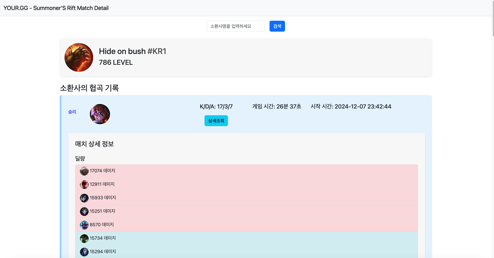
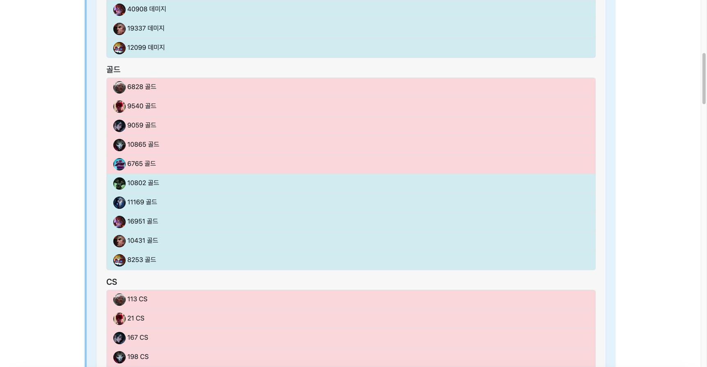
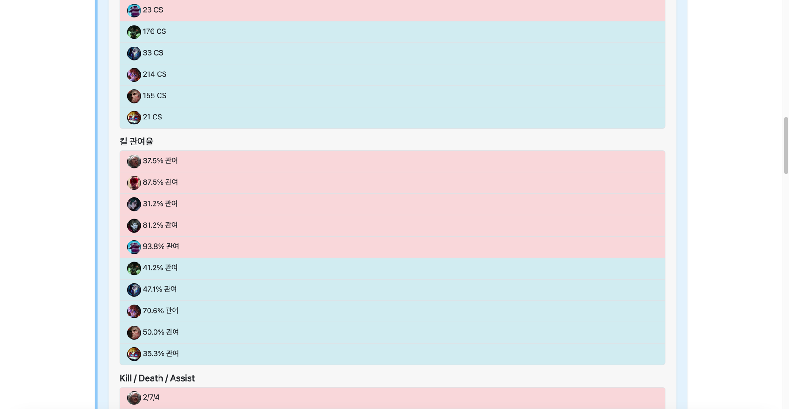
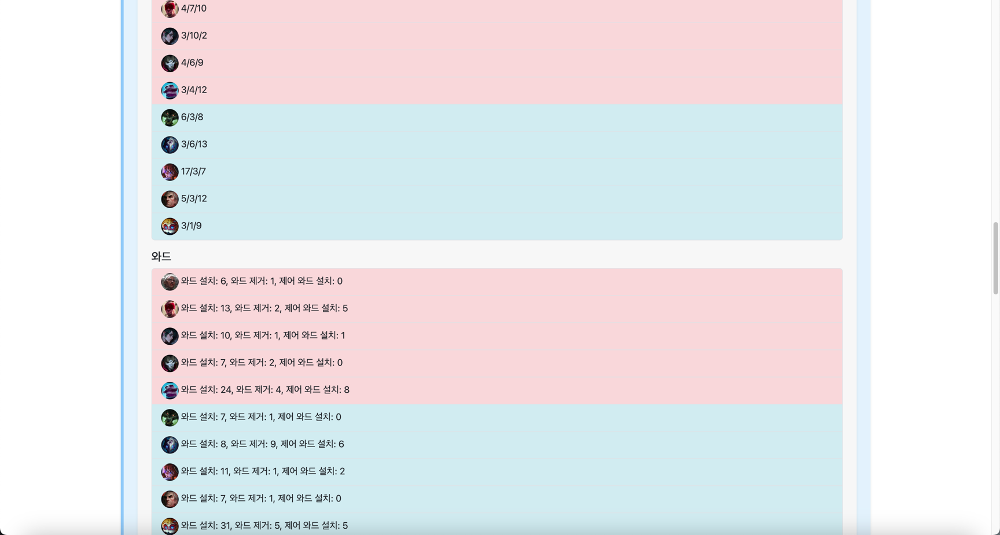
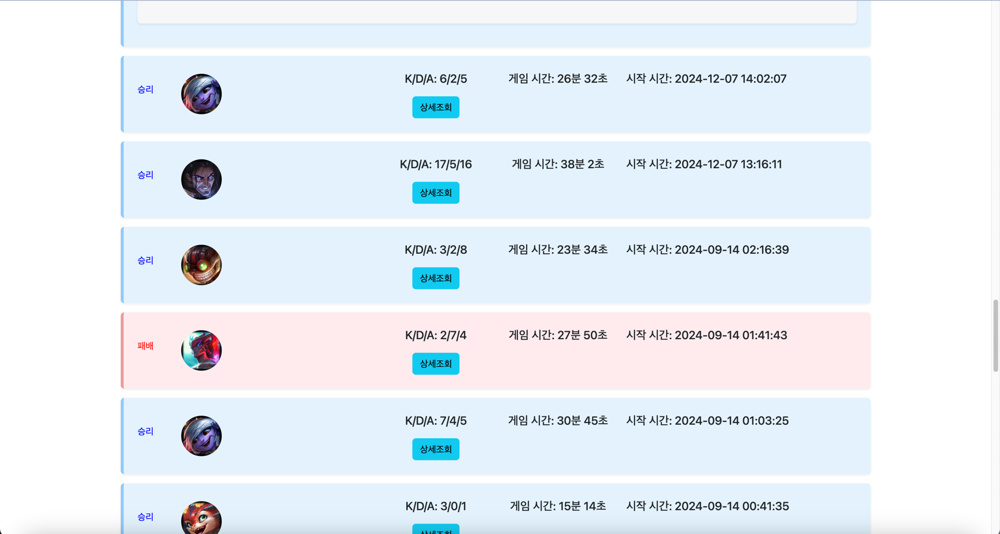

# GEN.G : YOUR.GG

### 과제 기간

2024/12/05 - 2024/12/08 (3일간 진행)

### 프로그램 소개

- League of Legend의 소환사 이름을 검색하면 최근 소환사의 협곡 매치(일반, 솔랭, 자랭) 20개 목록을 보여줍니다.
- 상세 조회 버튼을 누르면 해당 매치의 상세 정보를 보여줍니다.

**검색 후 정보**
- 공통 : 소환사  프로필, 닉네임, 레벨
- 기본 정보 : 승패 여부, K/D/A, 게임 시간, 게임 시작 시간
- 상세 정보 : 딜량, 골드, CS, 킬 관여율, K/D/A, 와드(와드 설치 수, 와드 제거 수, 제어 와드 설치 수)

## 과제 고려사항

### 개발 고려 사항

### 기술

- JAVA 17
- JUnit, Mockito
- Spring Boot 3.4.0
- Thymeleaf
- Javascript
- Git/Github
- Github Actions
- [Riot API](https://developer.riotgames.com/apis)

### 깃 전략

main → develop → feature

main : 상용 서버에 적용될 브랜치

develop : 개발 브랜치

feature : 각 기능을 구현할 브랜치

- feat/{name}-#{issue_number}

규칙

1. feature에서 develop으로 머지할 때는 squash 머지를 한다.
2. develop에서 main으로 머지할 때는 rebase 머지를 한다.

### 깃 컨벤션

- feat : 기능 구현
- refactor : 개선 사항
- test : 테스트 작성
- docs : 리드미 작성
- fix : 버그 수정
- chore : 세팅 업무